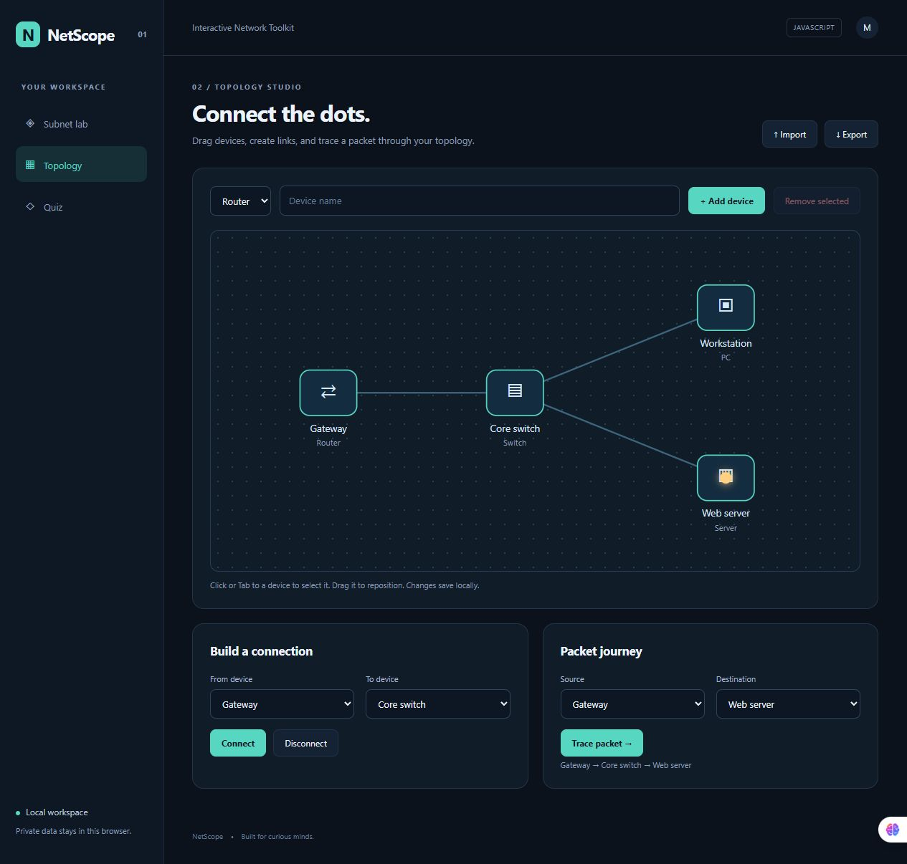

# NetScope — Interactive Network Toolkit

محاسبهٔ زیرشبکه، نمایش آدرس‌های شبکه و Broadcast، نقشهٔ تعاملی دستگاه‌ها و شبیه‌سازی مسیر بسته.

A working portfolio project exploring interactive network toolkit, built with JavaScript, HTML, CSS, and browser APIs.



## Features

- IPv4 subnet calculation with CIDR or contiguous dotted masks, address classes, host ranges, binary display, and /31 and /32 handling.
- Editable SVG topology with routers, switches, PCs, and servers; connect/disconnect, drag, JSON import/export, and local persistence.
- Shortest-path packet journey simulation and a four-question Network+ practice quiz.

## Run locally

Use **Node.js 22.13+**. Clone the repository, then run:

```sh
git clone https://github.com/MahtaRahmati/netscope.git
cd netscope
npm start
```

Open **http://127.0.0.1:4100**. The bundled sample provides a starting point; your own data can be entered or imported.

```sh
npm test
```

PORT can be changed through the environment. No dependency installation or build step is required.

## Project structure

- `public/` — responsive interface and browser-side domain logic
- `tests/` — meaningful domain checks
- `server.mjs` — small local static server
- `docs/` — screenshot and bilingual LinkedIn introduction

## Deployment

Serve the public/ folder through any static host. A GitHub Pages workflow is included. Enable **Settings → Pages → Source: GitHub Actions** to publish it. Expected URL after successful deployment: https://MahtaRahmati.github.io/netscope/ .

## Scope & data handling

IPv4 only. Class labels are historical. Packet tracing is an educational graph simulation, not live network traffic. Topologies stay in localStorage.

All sample records and addresses are fictional. The interface works on desktop and mobile and includes keyboard focus states, labeled controls, and status/error feedback.

## Built with

Native ES modules, DOM APIs, and CSS. No framework or chart dependency.

## License

MIT.
